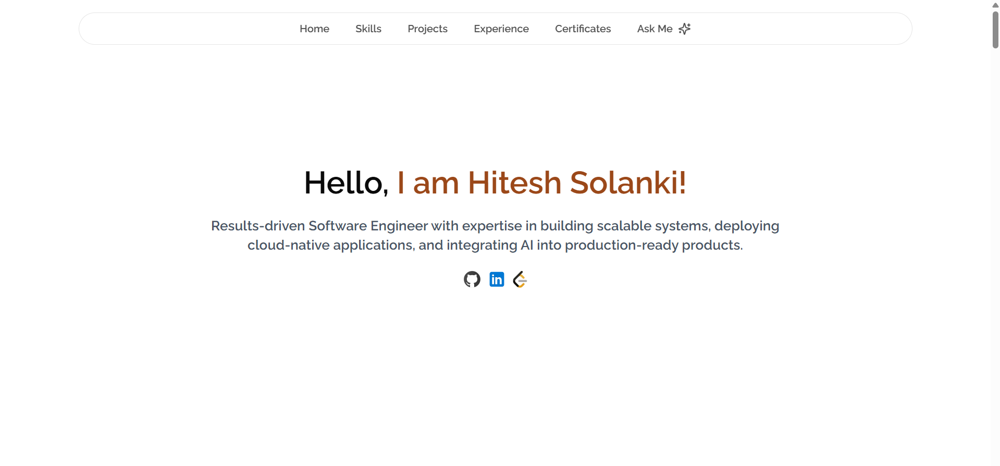
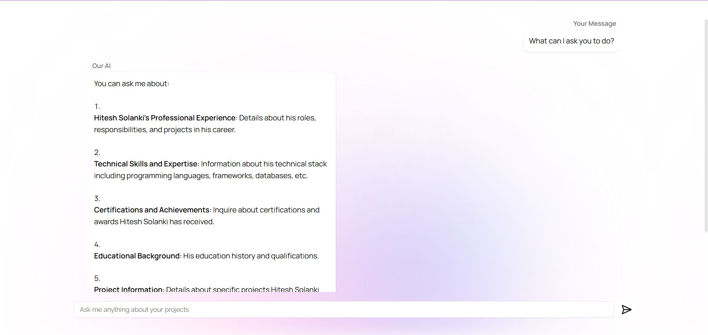
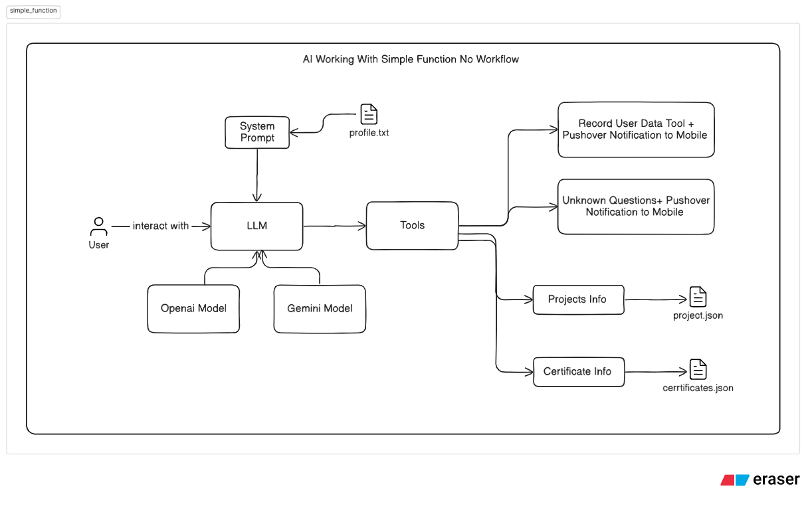

# Personal Portfolio v2

Welcome to **Personal Portfolio v2**! This repository contains a modern, interactive portfolio website for **Hitesh Solanki**, built with Next.js, TypeScript, Tailwind CSS, and integrated with an AI-powered Personal Portfolio Agent that lets you ask questions about Hitesh’s background in real time.

---

  

---

## 🚀 Live Demo

\:globe_with_meridians: [https://master.d2p4p6tfmpfvri.amplifyapp.com](https://master.d2p4p6tfmpfvri.amplifyapp.com)

[:link: GitHub Repository](https://github.com/Hitesh-s0lanki/personal-portfolio)

---

## ✨ Features

- **Home**: A clean introduction with a hero banner and links to social profiles.
- **Skills**: A detailed breakdown of technical skills, tools, and frameworks.
- **Projects**: Showcases key projects with descriptions, tech stack, and source code links.
- **Experience**: Timeline of professional roles, responsibilities, and achievements.
- **Certificates**: List of certifications and awards with issuing organizations and dates.
- **Ask Me**: An AI-powered chat interface (Personal Portfolio Agent) that answers queries about Hitesh’s experience, skills, projects, and more.

---

## 🛠 Technology Stack

- **Framework**: [Next.js](https://nextjs.org) (App Router)
- **Language**: TypeScript
- **Styling**: Tailwind CSS + [shadcn/ui](https://ui.shadcn.com)
- **Icons**: [Lucide Icons](https://lucide.dev)
- **AI Agent**: [Vercel AI SDK](https://ai-sdk.dev) + OpenAI, with [Firecrawl](https://firecrawl.dev) web tools
- **Deployment**: AWS Amplify

---

## 💻 Getting Started

### Prerequisites

- Node.js v18 or higher
- npm or yarn
- An OpenAI API key with access to GPT-4 or GPT-3.5

### Installation

1. **Clone the repository**

   ```bash
   git clone https://github.com/Hitesh-s0lanki/personal-portfolio.git
   cd personal-portfolio
   ```

2. **Install dependencies**

   ```bash
   npm install
   # or
   yarn install
   ```

3. **Configure environment variables**

   Copy `.env.example` to `.env` and fill it in:

   ```env
   OPENAI_API_KEY=your_openai_api_key_here
   # OPENAI_CHAT_MODEL=gpt-5.4-mini   # optional override
   FIRECRAWL_API_KEY=your_firecrawl_key_here   # optional, enables web tools
   RESEND_API_KEY=your_resend_api_key_here
   RESEND_FROM_EMAIL=your_verified_email@yourdomain.com
   RESEND_TO_EMAIL=your_email@yourdomain.com
   ```

   **Note**:
   - `OPENAI_API_KEY` is server-side only — it is never exposed to the browser.
   - `FIRECRAWL_API_KEY` ([firecrawl.dev](https://firecrawl.dev)) is optional; without
     it the assistant simply runs without web search and page reading.
   - Get your Resend API key from [resend.com](https://resend.com)
   - Verify your domain or use a verified email address for `RESEND_FROM_EMAIL`
   - `RESEND_TO_EMAIL` is where contact form submissions — and the assistant's
     contact hand-offs — are sent

4. **Run in development mode**

   ```bash
   npm run dev
   # or
   yarn dev
   ```

   Open [http://localhost:3000](http://localhost:3000) in your browser.

---

## 🤖 Personal Portfolio Agent

Click the ✨ launcher in the bottom-right corner of any page to open the assistant.
The panel has an expand toggle for a roomier view on desktop. The agent runs
entirely inside this app — no external service.

**How it works**

`POST /api/chat` streams a tool-calling loop built on the [Vercel AI SDK](https://ai-sdk.dev)
with OpenAI as the provider. The client hook flattens the streamed message parts
into chat bubbles and surfaces whichever tool is running.

| File | Role |
| --- | --- |
| [`src/app/api/chat/route.ts`](src/app/api/chat/route.ts) | Streaming endpoint — model, history window, step cap, rate limit |
| [`src/lib/ai/system-prompt.ts`](src/lib/ai/system-prompt.ts) | Voice, tool policy, formatting rules |
| [`src/lib/ai/profile.ts`](src/lib/ai/profile.ts) | The always-in-context bio |
| [`src/lib/ai/tools/`](src/lib/ai/tools/) | Tool definitions |
| [`src/hooks/use-chat.ts`](src/hooks/use-chat.ts) | Client hook backing the floating widget |

**Tools**

- `listProjects`, `getProject` — the project index and full detail, README included
- `getExperience`, `listCertificates`, `listBlogs`, `getSkills` — live portfolio data
- `recordContactRequest`, `recordUnansweredQuestion` — emailed to `RESEND_TO_EMAIL`
- `searchWeb`, `readWebPage` — Firecrawl, registered only when `FIRECRAWL_API_KEY` is set

Every tool reads the same modules the pages render from, so answers can't drift
from the site. The Firecrawl fetcher rejects non-HTTP schemes and private hosts.

_Example queries:_

> • What projects have you built with Spring Boot?
> • List all certifications you’ve achieved.
> • Tell me about your most challenging AI project.

---

## 📦 Deployment

This app is deployed on AWS Amplify. To update the live site:

1. Push changes to the `main` branch.
2. AWS Amplify automatically builds and deploys your updates.

---

## 🤝 Contributing

Contributions are welcome! Please open an issue or submit a pull request:

1. Fork the repo
2. Create a new branch (`git checkout -b feature/my-feature`)
3. Commit your changes (`git commit -m "feat: add awesome feature"`)
4. Push to your branch (`git push origin feature/my-feature`)
5. Open a Pull Request

---

## 📄 License

This project is licensed under the [MIT License](LICENSE).

---

## 📬 Contact

Have questions or feedback? Reach out on [LinkedIn](https://www.linkedin.com/in/hitesh-solanki) or open an issue here!
